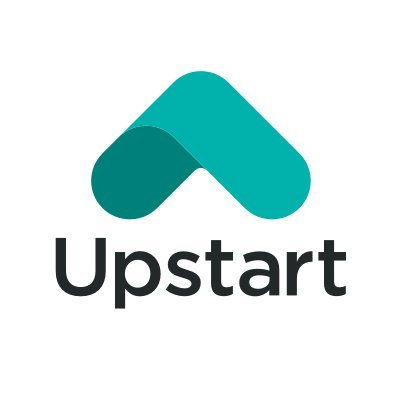

# **Upstart - An AI Lending Platform**

> `The world of lending has evolved. This is primarily driven by increasing customer expectations and the growing need for data sharing, customized services, mobile banking, e-KYC, e-sign, and online credit checks. With these changing industry dynamics, speed, personalization, and digital acceleration have become key imperatives for new-age business lenders.` 

Above is abstracted from "https://www.ciol.com/5-key-emerging-technology-trends-lending/"

## **Overview and Origin**

Upstart is a fintech company using AI technologies to create a more efficient and accessible finance lending marketplace. It partners with banks and credit unions to provide consumer loans using non – traditional variables, which are education and employment etc.. By leveraging Upstart's AI marketplace, Upstart-powered banks can offer higher approval rates and experience lower default rates, while simultaneously delivering the exceptional digital-first lending experience their customers demand.(quoted from Upstart website). This is a new company which was founded in 2012 with Dave Girouard, Paul Gu and Anna M. Counselman as the co-founders. 

* What is the name of the company?

  The company name is Upstart.

* When was the company incorporated?

  The company is incorporated in 2012. 

* Who are the founders of the company?

  There were three founders, who are Dave Girouard, Paul Gu and Anna M. Counselman. 

* How did the idea for the company (or project) come about? 

  Upstart developed an income and default prediction model to determine creditworthiness of a potential borrower. It uses non – traditional variables in addition to the traditional criteria of credit policies to develop a statistical model of a borrower’s financial capacity and personal propensity to repay. (abstracted from Wikipedia)

* How is the company funded? How much funding have they received?

  It got its first investment $1.75 million on the seed round. The it raises $5.9million on a series A round. Furthermore, it raised a series C round of $35m in 2015 and $32.5m in 2017. Its Series D round fund raising helped itself got $50M in 2019. The company went public in 2020. 

## **Business Activities**

It is a Fintech company which uses AI platform to assist banks and credit unions to improve the approving rate and shorten lending processing time. The activities helped consumers have better accessibility to the loan lending market as well.  

* What specific financial problem is the company or project trying to solve?

  The traditional lending market has low approving rate and high defaulting rate. Upstart developed a model using AI technologies to improve the consumers’ accessibility to the lending market. This helps the financial institutes increase the approving rates and also reduce the defaulting rates. 

* Who is the company's intended customer?  Is there any information about the market size of this set of customers?

  The intended customers are the banks and credit unions. There is no exact size of this market. 
  
  > `According to a report by MARKETSANDMARKETS, the global digital lending market size is expected to reach USD 20.5 billion by 2026, at a compound annual growth rate (CAGR) of 13.8% during the forecast period.` (quoted from "https://www.ciol.com/5-key-emerging-technology-trends-lending/") 
  
  It is believed that Upstart's partnership with More Than Fair and Economic Opportunity Coalition (EOC) would attract more private and public lenders to use their AI platform. It also attracts more consumers to use their platform to get loans. 

* What solution does this company offer that their competitors do not or cannot offer? (What is the unfair advantage they utilise?)

  Compared to the traditional lending operation methods, Upstart uses artificial intelligence technology to help lenders have better and quick assessment of applications to improve the approving rate and shorten the processing time. The platform adds non – traditional variables to generate more fair assessments on the applications.  The traditional competitors don’t use AI technologies to assist the process and also don’t use additional variables to improve the accessibility and fairness. 

* Which technologies are they currently using, and how are they implementing them? 

  Upstart uses artificial intelligence technology to develop its lending platform. 

## **Landscape**

It provides services to the American market at this stage. 

* What domain of the financial industry is the company in?

  It provides services to the finance lending sector. Borrowers can consolidate theirs debts on its platform and finance their debts. 
* What have been the major trends and innovations of this domain over the last 5–10 years?

  1. application and approving process is digitalised
  2. the interaction is more digitalised such as using rob - advisor
  3. electronic signature is being used more often than physical signatures
  4. peer to peer lending is becoming more common by using fintech. 
  5. API is used to consolidate multiple accounts to have better and more    accurate assessment of creditworthiness. 

* What are the other major companies in this domain?

  The following are some of the major companies in this domain:

  1.	Avant LCC, formerly called AvantCredit. It uses algorithms, machine – learning and analytical tools etc. to determine the lending deals. 

  2.	SoFi Technologies, Inc. It uses algorithms and machine learning to do creditworthiness assessment for lending. 

## **Results**

* What has been the business impact of this company so far?

  It has increased the successful rate of loan applications and reduced the default rate of repayment in the lending market. 

* What are some of the core metrics that companies in this domain use to measure success? How is your company performing, based on these metrics?

  1. Leads
  2. Conversions
  3. Customer Acquisition Cost (CAC)
  4. Customer Lifetime Value (CLV)
  5. Revenue
    
  Note: the above is abstracted from Oak Business Consultant (https://oakbusinessconsultant.com/fintect-financial-metrics/)

* How is your company performing relative to competitors in the same domain?

  It has acquired several rounds of investments from investors and been public listed. Its stock price went highest at $322/share in Oct 2021 and then dropped down to $14.40/share on 21/12/2022. It does not seem performing well based on the trend of its share price over the past two years. 

## **Recommendations**

* If you were to advise the company, what products or services would you suggest they offer? 

  It is recommended to incorporate payment processing systems into their lending systems, so the consumers can use its platform more often on daily life, which makes the users prefer to borrowing money from the platform.

* Why do you think that offering this product or service would benefit the company?

  It attracts more consumers and also enhance the customers use experience. That further attract more financial lenders to use their platforms to lend money to the market. 

* What technologies would this additional product or service utilise?

  It will use payment processing technology to help the platform. There are three new payment architectures designed to improve secure mobile payments: Encryption and tokenization, cloud – based PoS systems and secure element systems. (referred from Trend Micro (https://www.trendmicro.com)

* Why are these technologies appropriate for your solution?

  Those systems are used to process payments at PoS.

## **Appendix**

The above contents come from the following websites:

https://www.ciol.com/

https://www.wikipedia.org/

https://www.upstart.com/

https://www.economicopportunitycoalition.org/

https://www.morethanfair.org/
